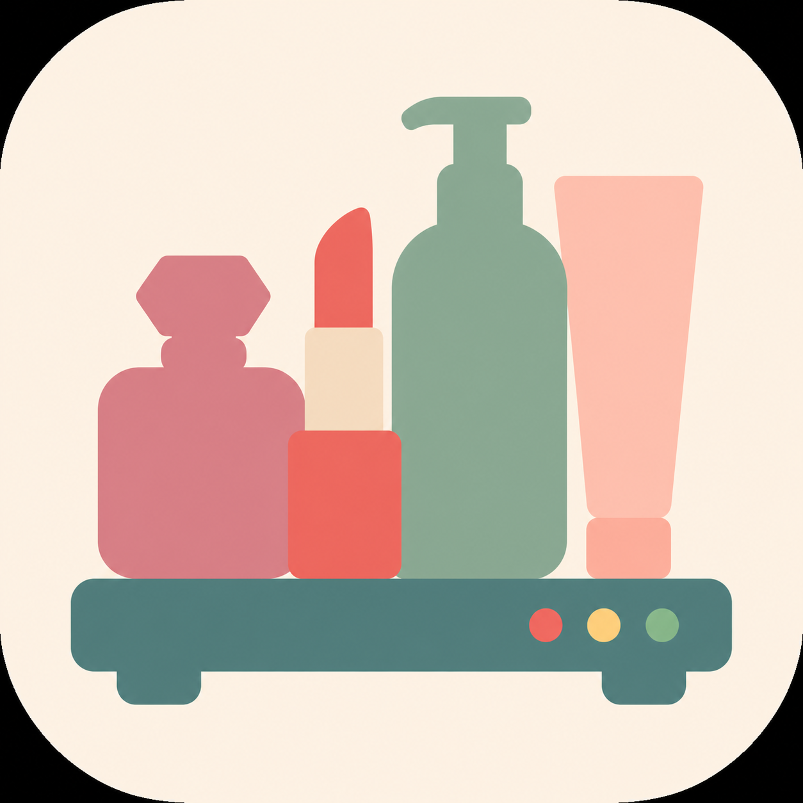
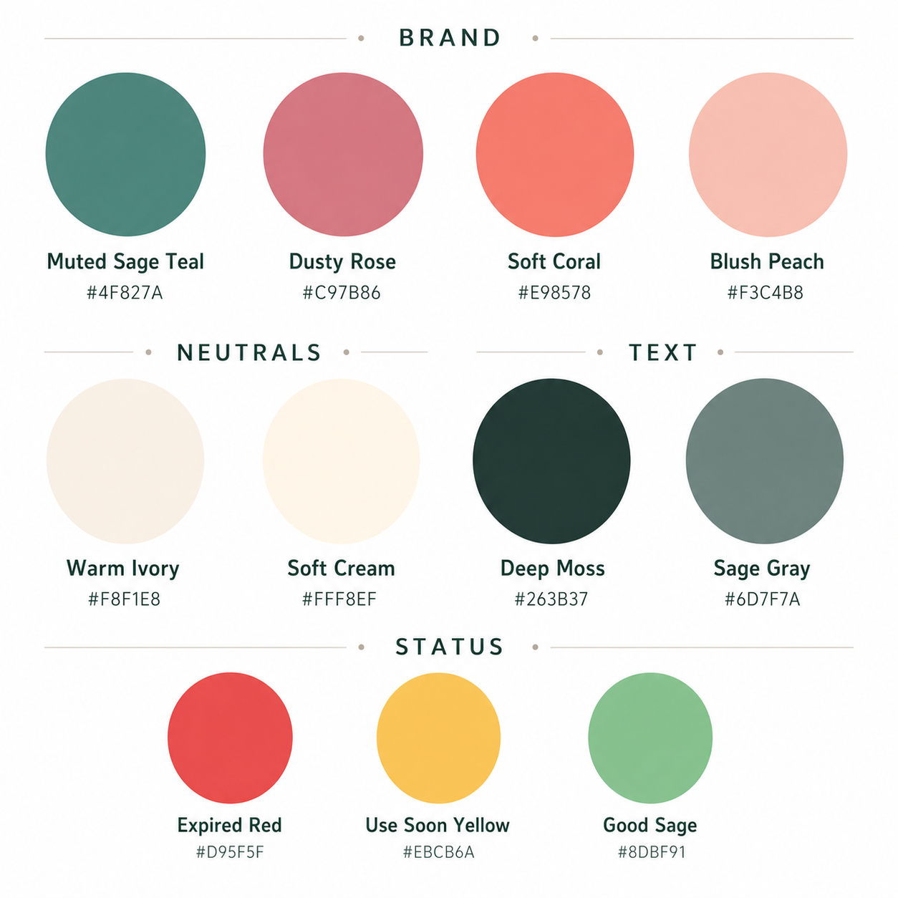

# Cosmetics Shelf

  

An iPhone app prototype for tracking beauty inventory across skincare, makeup, fragrance, hair/body, and other categories.

The app is built with SwiftUI and SwiftData for iOS 17+. It stores products locally, estimates shelf life, and helps prioritize items before they expire.

## Visual Direction

Cosmetics Shelf uses a soft, chic skincare-inspired visual system with muted sage, dusty rose, warm cream, and small red/yellow/green status accents for expiry reminders.

## Features

- Categorize products by skincare, makeup, fragrance, hair/body, and other
- Record brand, product names, batch code, purchase date, manufacture date, opened date, and notes
- Support local/Chinese product name plus English or official product name
- Follow the iPhone system language for the main app UI
- Estimate expiry from manufacture date, period after opening, or manual expiry date
- Use the earliest available expiry date as the recommended expiry
- Show products in the reminder list 6 months before suggested expiry
- Schedule local notifications for use-soon reminders
- Search public beauty product data by name and fill in candidate name, brand, image URL, and source URL
- Keep manual entry as a fallback when product or batch-code lookup is unavailable

## Current Status

This is a working local prototype. Product info lookup uses a public beauty product database first, while official product URLs and image URLs can still be entered manually. Batch-code parsing is prepared as a feature entry point, but brand-specific reliable parsing rules still need to be added.

## Planning Docs

- [Product info lookup PRD](docs/product-info-lookup-prd.md)
- [Product info and batch lookup design doc](docs/product-info-lookup-design.md)

## Run Locally

1. Open `CosmeticsShelf.xcodeproj` in Xcode.
2. Select an iPhone Simulator or connected iPhone.
3. In `Signing & Capabilities`, choose your Apple ID team if running on a physical device.
4. Press `Run`.

## Validation

The project has been built successfully with Xcode using the iPhone Simulator SDK.
