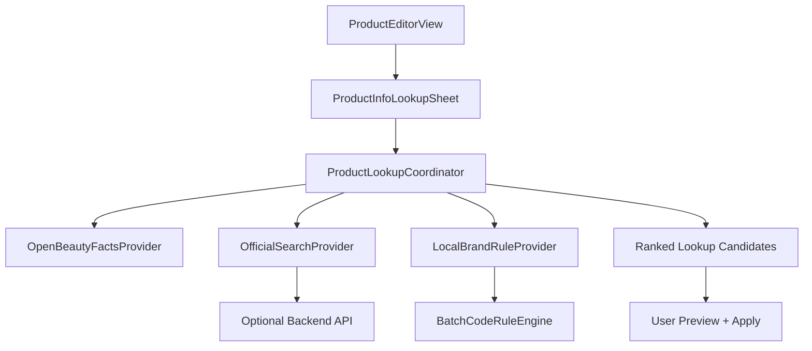

# Design Doc: Product Info And Batch Lookup

## Context

Cosmetics Shelf already has:

- `ProductEditorView` with "Find Product Info Automatically"
- `ProductInfoLookupSheet` for candidate selection
- `ProductLookupService.searchProducts(query:)` using Open Beauty Facts
- `ProductLookupService.lookupBatchCode(brand:batchCode:)` as a placeholder
- `ProductItem` fields for names, brand, image URL, official URL, batch code, manufacture date, expiry date, unopened shelf life, and PAO

This design turns the prototype into a structured lookup system with provider abstraction, ranked candidates, confidence, and batch-code parsing.

## Requirements

- Search by product name and brand.
- Support local/system-language product display.
- Return candidates with image, product page, brand, category, and source.
- Rank candidates by confidence.
- Keep manual fallback.
- Parse batch codes only through known brand rules or trusted services.
- Avoid storing API keys in the iOS app.
- Keep implementation testable with mocked lookup providers.

## High-Level Architecture



## Data Model

### ProductLookupCandidate

Replace or expand `ProductSearchCandidate`:

```swift
struct ProductLookupCandidate: Identifiable, Hashable {
    let id: String
    let localName: String
    let englishName: String
    let brand: String
    let category: ProductCategory?
    let imageURL: URL?
    let productPageURL: URL?
    let barcode: String?
    let source: LookupSource
    let confidence: LookupConfidence
    let matchReasons: [String]
}
```

### LookupSource

```swift
enum LookupSource: String, Codable {
    case officialWebsite
    case openBeautyFacts
    case localBatchRule
    case manual
}
```

### LookupConfidence

```swift
enum LookupConfidence: String, Codable, Comparable {
    case high
    case medium
    case low
}
```

### ProductItem Additions

Near-term optional fields:

```swift
var barcode: String
var lookupSource: String
var lookupConfidence: String
var lookupUpdatedAt: Date?
var productRegion: String
```

These should be optional/defaulted to avoid breaking existing local data.

## Lookup Providers

### Protocol

```swift
protocol ProductLookupProvider {
    func search(query: ProductLookupQuery) async throws -> [ProductLookupCandidate]
}
```

### ProductLookupQuery

```swift
struct ProductLookupQuery {
    var freeText: String
    var brand: String
    var barcode: String
    var localeIdentifier: String
    var preferredLanguageCode: String
}
```

## Provider Strategy

### OpenBeautyFactsProvider

Current `searchProducts(query:)` becomes the first provider.

Responsibilities:

- Query Open Beauty Facts.
- Map product fields into `ProductLookupCandidate`.
- Mark source as `.openBeautyFacts`.
- Assign medium confidence for name + brand + image matches.
- Assign high confidence for exact barcode matches if barcode search is added.

### OfficialSearchProvider

Recommended implementation: backend-assisted.

Why backend:

- Search APIs need keys that should not be shipped in the iOS app.
- Official sites vary heavily.
- Rate limiting and parsing should be controlled server-side.
- Search and parsing logic can improve without App Store releases.

Backend response shape:

```json
{
  "candidates": [
    {
      "name": "Advanced Genifique Face Serum",
      "brand": "Lancome",
      "imageURL": "https://...",
      "productPageURL": "https://...",
      "source": "officialWebsite",
      "confidence": "high",
      "matchReasons": ["official domain", "brand match", "name match"]
    }
  ]
}
```

Official page detection:

- Maintain a known official-domain list per brand.
- Prefer exact brand domain or brand-owned marketplace page.
- Parse metadata in this order:
  - JSON-LD product schema
  - Open Graph title/image/url
  - Twitter card title/image
  - HTML title as fallback

Do not copy product images into the app database by default. Store image URL and let SwiftUI load it. Add local thumbnail cache later only if needed.

### LocalBrandRuleProvider

This provider does not find product info. It supports batch-code parsing and shelf-life hints.

Example rule shape:

```swift
struct BatchCodeRule {
    let brandAliases: [String]
    let pattern: Regex<Substring>
    let parser: (String, Date) -> BatchCodeLookupResult?
    let defaultUnopenedShelfLifeMonths: Int
    let confidence: LookupConfidence
    let sourceDescription: String
}
```

This should be tested carefully with sample codes.

## Batch Code Lookup Design

Batch codes are brand/manufacturer-specific. The app should not guess across unknown brands.

Flow:

1. User enters brand and batch code.
2. Normalize brand aliases, such as "Lancome" and "Lancôme".
3. Find matching rule.
4. Parse manufacture date.
5. Estimate unopened expiry from brand/category shelf-life default.
6. Return confidence and explanation.
7. If no rule exists, return no result and ask for manual date.

Result:

```swift
struct BatchCodeLookupResult {
    let manufactureDate: Date?
    let expiryDate: Date?
    let confidence: LookupConfidence
    let sourceDescription: String
}
```

Important: batch-code parsing should show "estimated manufacture date" unless data comes from an official source.

## Ranking

Use a score-based ranker inside `ProductLookupCoordinator`.

Suggested scoring:

- +100 exact barcode match
- +60 official website source
- +35 brand exact match
- +25 product name exact or near-exact match
- +15 image exists
- +10 source URL exists
- -40 missing brand
- -50 suspicious domain
- -30 low text similarity

Confidence mapping:

- High: score >= 120
- Medium: score 70-119
- Low: score < 70

The UI should sort high to low and show the source label.

## UI Changes

### ProductInfoLookupSheet

Add:

- Search fields for brand and product name separately.
- Optional barcode field.
- Candidate confidence badge.
- Candidate source label.
- "Preview changes" step before applying.
- Empty state with manual fallback.

Candidate row:

- 56-64 pt image thumbnail
- Product display name
- English/official name when different
- Brand
- Source + confidence

### ProductEditorView

Keep fields editable after apply.

After applying a candidate:

- Fill empty fields by default.
- Ask before overwriting non-empty fields.
- Show a small "Filled from ..." message.

### Batch Lookup

The batch lookup button should return:

- Manufacture date if known
- Expiry estimate if known
- Confidence
- Explanation

If unknown:

- "No reliable rule for this brand yet"
- Manual date fields remain visible

## Error Handling

User-facing errors:

- No reliable candidate found.
- Network unavailable.
- Product database unavailable.
- Official lookup unavailable.
- Batch code not supported for this brand.

Technical errors should be logged in development but not shown as raw messages.

## Privacy

On-device Phase 1:

- Query goes directly to public product database only after user taps search.

Backend Phase 2:

- Send only the active query and optional locale.
- Do not send full inventory.
- Avoid storing raw user queries longer than needed.

## Testing Plan

Unit tests:

- Open Beauty Facts decoding.
- Candidate ranking.
- Empty query behavior.
- Source/confidence mapping.
- Batch-code rule parsing.
- Brand alias normalization.

UI tests:

- Product lookup sheet opens.
- Search returns mock candidates.
- Applying candidate fills fields.
- Manual fallback remains available.
- Batch lookup success and failure states.

Integration tests:

- Provider timeout handling.
- Invalid image URL handling.
- Network failure path.

## Implementation Plan

### Step 1: Refactor Existing Lookup Types

- Rename `ProductSearchCandidate` to `ProductLookupCandidate`.
- Add `source`, `confidence`, `category`, and `matchReasons`.
- Keep existing Open Beauty Facts search working.

### Step 2: Add Coordinator And Ranking

- Add `ProductLookupCoordinator`.
- Move ranking out of the SwiftUI sheet.
- Add mock provider for tests.

### Step 3: Improve UI

- Show source and confidence.
- Add preview-before-apply.
- Avoid overwriting non-empty fields without confirmation.

### Step 4: Add Local Batch Rule Engine

- Add brand alias normalization.
- Add 3-5 starter brands only after validating sample formats.
- Add tests for each supported rule.

### Step 5: Optional Backend Design

- Define `/lookup/product` API.
- Use a licensed search provider server-side.
- Parse official page metadata.
- Add feature flag in app to call backend when configured.

## Risks

- Public product databases may be incomplete or inaccurate.
- Official websites may block automated access.
- Batch-code rules can change by manufacturer and region.
- Product images may disappear or change.
- Low-confidence auto-fill could damage trust.

Mitigations:

- Always show source and confidence.
- Keep manual fallback.
- Avoid silent overwrites.
- Start with a limited brand set.
- Prefer exact barcode and official-domain matches.

## Recommended Next Build

The next practical build should implement Step 1 through Step 3. That gives the app a much better product info workflow without requiring backend infrastructure. Batch-code rules can then be added brand by brand with tests.
